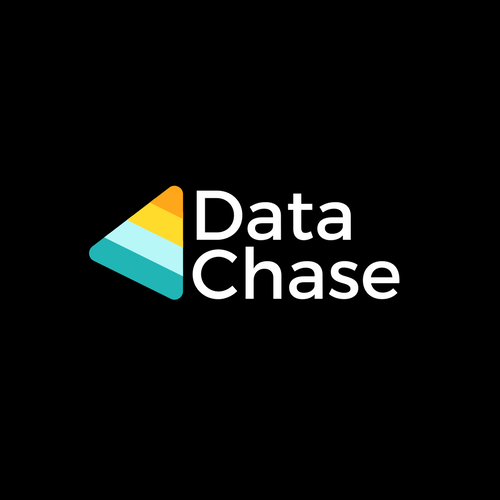

# Data-Chase
## Smart Office System

##Overview
Data Chase smart office system is based on MQTT messaging which consists of android application and raspberry pi gateway.
You can control your office device such as cameras, lights etc. Also can receive temperature and humidity values on your app over MQTT messages.

## System Architecture
Data Chase has one raspberry pi card for gateway utilities and also has required sensors so that catching the values on your office and controlling devices which stands in your office. The other part of system is Android application. System has only android application but its ios version will be launched as soon as possible.
